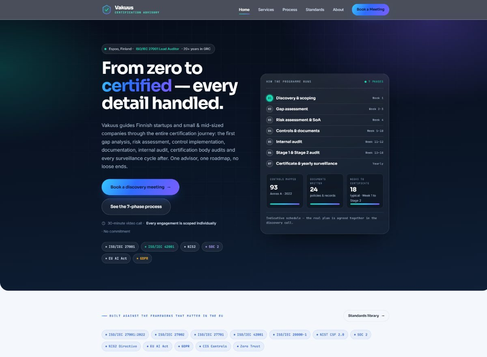
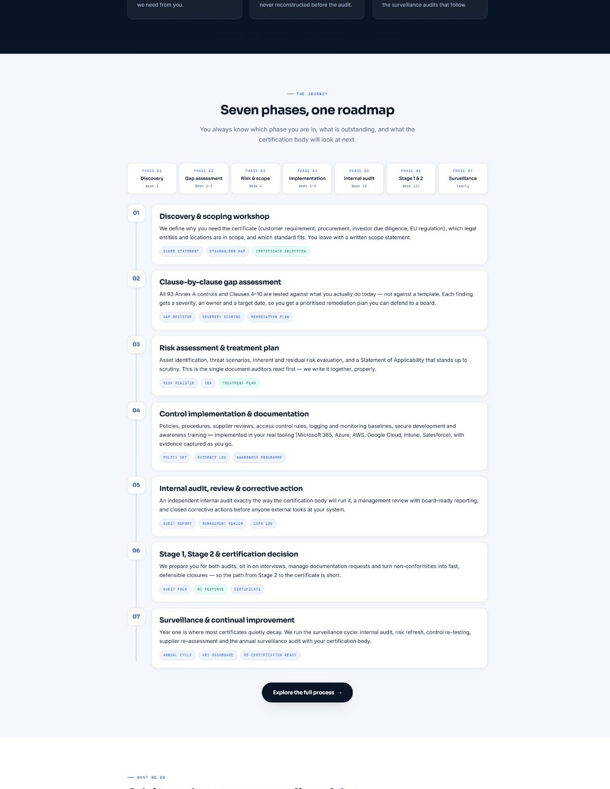
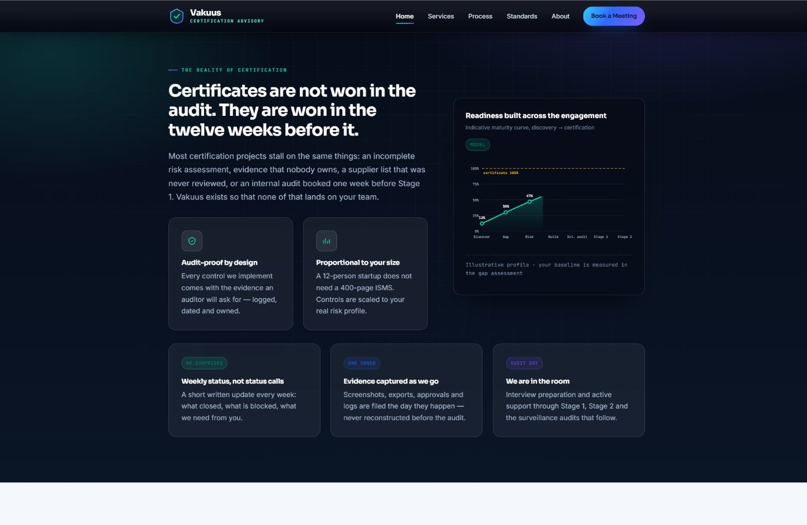
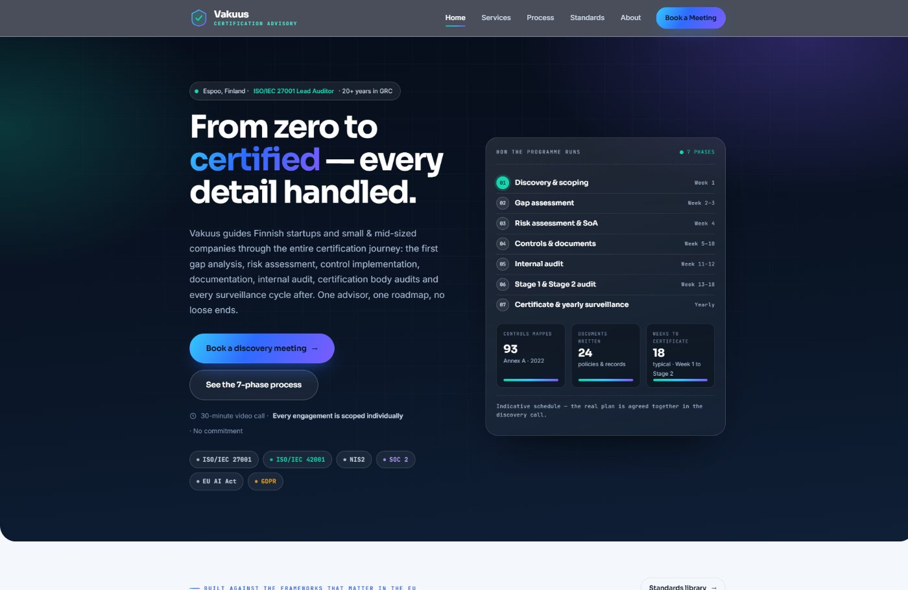
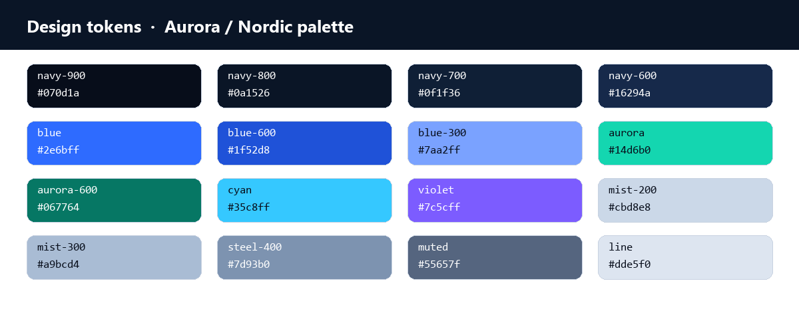
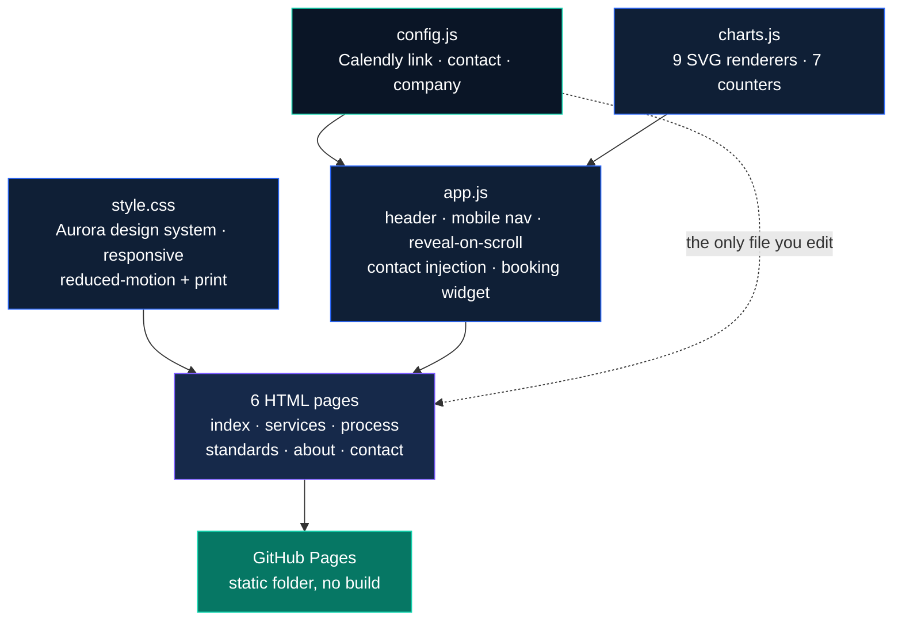

<p align="center">
  
</p>

<h1 align="center">Vakuus — Certification Advisory</h1>

<p align="center">
  <strong>From zero to certified — every detail handled.</strong><br>
  An English-language, six-page marketing site for Finnish startups and SMEs, guiding visitors through
  the entire certification journey and towards one action: <em>booking a discovery meeting</em>.
</p>

<p align="center">
  <a href="https://erdalbirinci.github.io/Vakuus/"></a>
  <a href="https://github.com/ErdalBirinci/Vakuus"></a>
  <a href="#chart-kit"></a>
  
  <a href="#quality-assurance"></a>
  <a href="#quality-assurance"></a>
  <a href="#content-rules"></a>
</p>

---

## ✨ Preview

<p align="center">
  
</p>

<table>
  <tr>
    <td width="50%">
      <br>
      <sub><strong>The journey.</strong> Seven phases with weeks, outputs and sign-off gates — the same
      roadmap is detailed on <a href="https://erdalbirinci.github.io/Vakuus/process.html">Process</a>.</sub>
    </td>
    <td width="50%">
      <br>
      <sub><strong>The evidence.</strong> Hand-built SVG charts carry <em>indicative / model</em> footnotes —
      never invented market statistics.</sub>
    </td>
  </tr>
  <tr>
    <td colspan="2">
      <br>
      <sub><strong>The conversion.</strong> <a href="https://erdalbirinci.github.io/Vakuus/contact.html">Contact</a>
      embeds the real Calendly scheduler; every “Book a Meeting” button on every page points to it.</sub>
    </td>
  </tr>
</table>

---

## 🎯 At a glance

| | |
|---|---|
| **Purpose** | Marketing site for a certification advisory serving Finnish startups & SMEs |
| **Language** | English (site, content, UI) |
| **Pages** | 6 — Home, Services, Process, Standards, About, Contact |
| **Stack** | Hand-written HTML · CSS · JavaScript — **no framework, no build step, no npm** |
| **Charts** | 17 charts (9 SVG renderer types) + 7 animated counters, all hand-built in `charts.js` |
| **Booking** | Live Calendly embed — `calendly.com/erdalbirinci/30min` |
| **Accessibility** | axe-core (WCAG 2.1 AA): **0 violations** · Lighthouse a11y **1.0** · SEO **1.0** |
| **Pricing** | **None anywhere** — commercial scoping only happens inside a meeting |
| **Live** | <https://erdalbirinci.github.io/Vakuus/> |

---

## 📄 Pages

| File | Purpose | Live |
|---|---|---|
| `index.html` | Positioning, 7-phase route panel, services overview, audience, credibility, FAQ | [open](https://erdalbirinci.github.io/Vakuus/) |
| `services.html` | Six service blocks — `#gap` `#isms` `#risk` `#audit` `#stage` `#regulatory` | [open](https://erdalbirinci.github.io/Vakuus/services.html) |
| `process.html` | The 7 phases in detail: gantt timeline, effort split, sign-off gates, FAQ | [open](https://erdalbirinci.github.io/Vakuus/process.html) |
| `standards.html` | Standards library: ISO 27001 · 42001 · 27701 · 20000-1, SOC 2, NIST CSF, NIS2, EU AI Act, GDPR | [open](https://erdalbirinci.github.io/Vakuus/standards.html) |
| `about.html` | Erdal Birinci — competencies and working principles (explicitly **not** a CV) | [open](https://erdalbirinci.github.io/Vakuus/about.html) |
| `contact.html` | Booking page: agenda, live scheduler, contact routes, FAQ | [open](https://erdalbirinci.github.io/Vakuus/contact.html) |

Every page ends in the same conversion path: **book a discovery meeting**.

---

## 🧭 Content rules

These are deliberate constraints, not accidents — please keep them when editing:

| Rule | Why |
|---|---|
| **No pricing, fees, rates or currency anywhere** | Verified by grep across all files; scoping happens in the meeting |
| **No ambiguous readiness percentages** | The hero shows a clear 7-phase route, not a self-assessment score |
| **No vendor, employer or client names** | The site sells a method, not a résumé |
| **Every chart states its data basis** | Footnotes say *indicative*, *model* or *reference* — nothing is presented as measured fact |
| **No testimonials, no market statistics** | Nothing is invented to look impressive |
| **About = competencies, not career history** | No roles, dates or employers — capability cards and a profile chart instead |

---

## 🎨 Design system

<p align="center">
  
</p>

| Token group | Values |
|---|---|
| Surfaces | `navy-900 #070d1a` · `navy-800 #0a1526` · `navy-700 #0f1f36` · `navy-600 #16294a` |
| Brand | `blue #2e6bff` · `blue-600 #1f52d8` · `blue-300 #7aa2ff` |
| Accent | `aurora #14d6b0` · `cyan #35c8ff` · `violet #7c5cff` |
| Text | `white #ffffff` · `mist-200 #cbd8e8` · `mist-300 #a9bcd4` · `steel-400 #7d93b0` · `muted #55657f` |
| Lines | `line #dde5f0` (light surfaces), translucent white on dark surfaces |

**Gradients** — `--brand-gradient`: `120deg, cyan → blue 42% → violet` (buttons, headings) and
`--aurora-gradient`: `115deg, aurora → cyan 48% → violet` (accents, highlights).

**Typography** (Google Fonts with full system fallbacks, so the site still renders offline):

| Role | Family |
|---|---|
| Headings | **Sora** → `Segoe UI`, `system-ui`, sans-serif |
| Body | **Inter** → `Segoe UI`, `system-ui`, sans-serif |
| Labels, data, code | **JetBrains Mono** → `ui-monospace`, `Consolas`, monospace |

---

## 📊 Chart kit

`assets/js/charts.js` is a dependency-free SVG chart engine (≈800 lines). It reads plain HTML
markers, renders responsive SVG, animates on scroll and degrades to static graphics under
`prefers-reduced-motion`.

| Renderer | Used on site | Counts |
|---|---|---|
| `bars` | Standards, process, about | ×6 |
| `donut-multi` | Standards comparison, effort split | ×3 |
| `radar` | Capability profile | ×2 |
| `stack` | Control domains | ×2 |
| `area` | Adoption over time | ×1 |
| `line` | Maturity path | ×1 |
| `grouped` | Before / after effort | ×1 |
| `gantt` | Process timeline | ×1 |
| `donut` | Available (hero panel now uses the route list) | — |
| Animated counters | Home statistics strip | ×7 |

Every chart carries `aria-label` + a visible footnote stating whether the numbers are
**indicative**, a **model** or **reference values**.

---

## 🏗️ Architecture



### Repository layout

```text
Vakuus/
├─ index.html            home — hero route panel, services, audience, credibility, FAQ
├─ services.html         six service blocks with anchors
├─ process.html          7 phases · gantt · effort split · sign-off gates
├─ standards.html        standards library + comparison charts
├─ about.html            competencies & working principles
├─ contact.html          agenda · live Calendly · contact routes · FAQ
├─ robots.txt · sitemap.xml · README.md
├─ docs/                 artwork used by this README (banner, palette, previews)
└─ assets/
   ├─ css/style.css      design system, responsive, print, reduced-motion
   └─ js/
      ├─ config.js       ← the only file you normally edit
      ├─ charts.js       SVG chart kit + animated counters
      └─ app.js          header, nav, reveal, contact injection, booking
```

> **5,260 lines** across 6 pages + 4 assets — no frameworks, no trackers, no npm.

---

## ⚙️ Configuration

All site-wide data lives in **`assets/js/config.js`**; pages read it through `data-contact` /
`data-company` attributes, so nothing is edited page by page.

```js
window.VAKUUS_CONFIG = {
  calendly: {
    url: "https://calendly.com/erdalbirinci/30min",  // live scheduling page
    placeholder: false,                              // true = built-in fallback panel
    text: "Pick a time that suits you — 30 minutes, video call, no obligation."
  },
  contact: { name, role, email, phone, linkedin, location, timezone, languages },
  company: { name: "Vakuus", tagline, legal, domain: "vakuus.fi" }
};
```

<details>
<summary><b>Calendly is connected — keep the widget height</b></summary>

<br>

- `placeholder: false` embeds the **real** scheduler in `contact.html`; all “Book a Meeting”
  buttons resolve to the same link (they read `data-calendly-url`).
- If the Calendly script fails to load, `app.js` automatically restores the designed fallback
  panel with an “Open the calendar” button — the page never breaks.
- Calendly sizes its iframe from the container's **explicit height**. `.calendly-inline-widget`
  in `style.css` therefore sets `height: 700px` (780px on mobile) with `width: 100%`.
  **Removing that height makes the scheduler collapse into a 150px iframe and hang behind its
  own loading spinner.** Keep it.
- Lighthouse *best practices* on the contact page scores 0.77 — both failing audits
  (`third-party-cookies`, `inspector-issues`) come from **Calendly's own** cookies
  (`__cf_bm`, `_cfuvid`, `m.stripe.com`), not from this codebase.

</details>

<details>
<summary><b>Switch to a custom domain</b></summary>

<br>

`config.js → company.domain`, `robots.txt`, `sitemap.xml` and the `<link rel="canonical">` /
`og:url` tags in every page head currently point to `https://vakuus.fi`. When the domain is live,
either add a `CNAME` file for GitHub Pages or repoint those tags to the final URL.

</details>

---

## ▶️ Run locally

```powershell
python -m http.server 8098 --bind 127.0.0.1   # from this folder
# → http://127.0.0.1:8098/index.html
```

Double-clicking the `.html` files also works: there is no fetch/XHR anywhere in the project.

---

## 🚀 Deploy

1. Push to `main` on **[ErdalBirinci/Vakuus](https://github.com/ErdalBirinci/Vakuus)**.
2. **Settings → Pages → Deploy from branch → `main` / `root`** (already enabled).
3. ~25 seconds later the site is live at
   **<https://erdalbirinci.github.io/Vakuus/>**.

The same folder also runs unchanged on Netlify, Vercel, Cloudflare Pages or any nginx/Apache
document root.

---

## ✅ Quality assurance

| Gate | Result |
|---|---|
| **axe-core 4.10.2** (WCAG 2.1 AA) | **0 violations** on all 6 pages |
| **Lighthouse** accessibility | **1.0** (all pages) |
| **Lighthouse** SEO | **1.0** (all pages) |
| **Lighthouse** best practices | 1.0 — contact page 0.77 (Calendly's third-party cookies, see above) |
| **Responsive** | No horizontal overflow at 320 · 360 · 460 · 560 · 720 · 940 · 1200 px |
| **Motion** | `prefers-reduced-motion: reduce` switches all animation off |
| **Print** | Print stylesheet hides header/nav/actions and inverts dark sections |
| **Semantics** | Landmark elements, skip link, heading order, 32 `aria-label`s, visible focus rings |
| **Pricing grep** | No price / fee / rate / currency / quotation wording in any file |

<details>
<summary><b>How QA was run</b></summary>

<br>

```powershell
# accessibility audit in-page (axe-core 4.10.2 from CDN), run on every page
# Lighthouse, three categories per page:
npx --yes lighthouse <page> --only-categories=accessibility,best-practices,seo --output=json
# overflow check: measured scrollWidth vs clientWidth at the widths listed above
```

Browser QA is done against the **deployed** GitHub Pages URL (hard reload — Pages caches
assets for 600s), not only against `localhost`.

</details>

---

## 🗺️ Roadmap

- [ ] Custom domain (`vakuus.fi`) + repoint canonical/OG tags
- [ ] Anonymised case studies / project examples
- [ ] Guidance articles (certification journal) for organic reach
- [ ] JSON-LD structured data for the service offering
- [ ] Finnish (and Swedish) localisation of key pages
- [ ] Optional: open Calendly in a new tab if a 1.0 best-practices score is required on `/contact`
- [ ] Optional: self-host the three fonts to remove the Google Fonts third-party request

---

## 📌 Notes

- **No pricing information** exists anywhere in the site — by design.
- No analytics, no cookies set by this codebase, no third-party scripts **except** Calendly
  (booking) and Google Fonts (typography, with system fallbacks).
- Brand: **Vakuus** — independent certification advisory, Espoo, Finland.

<p align="center"><sub>Vakuus — from zero to certified. · Content &amp; design © Vakuus, all rights reserved.</sub></p>
